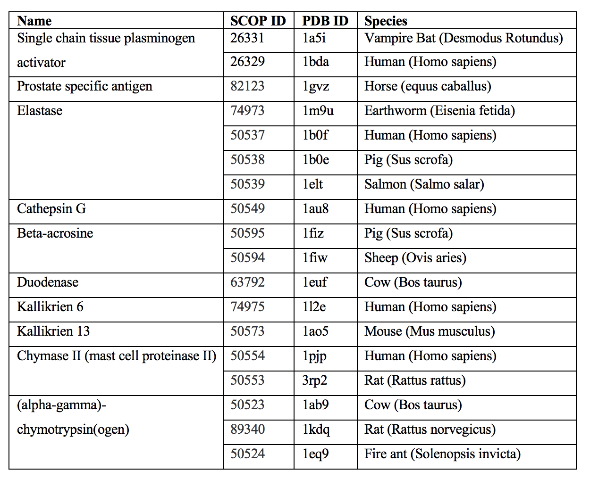
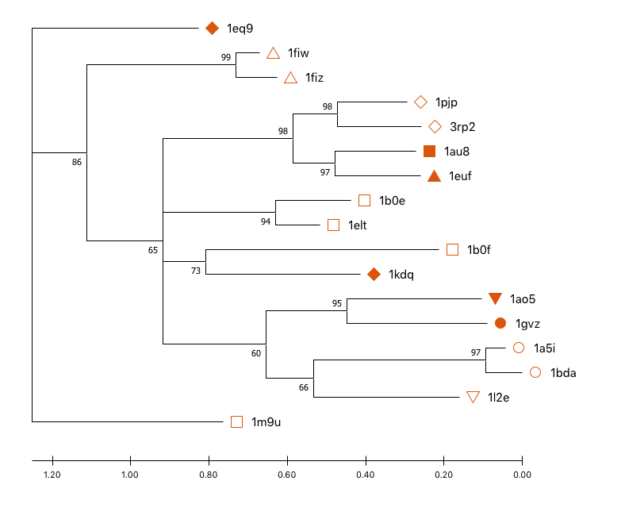
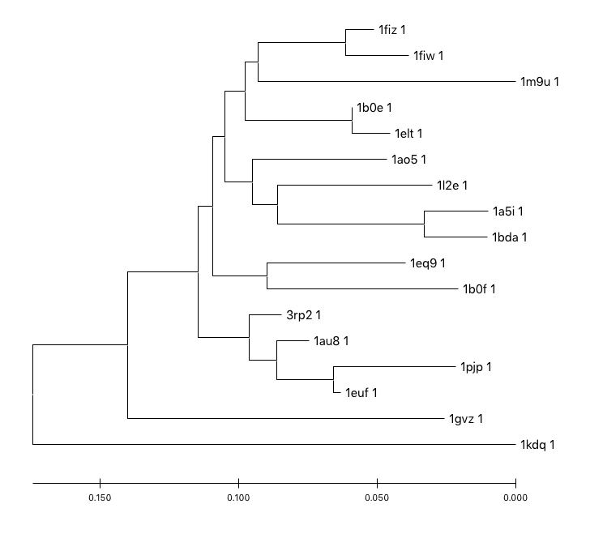
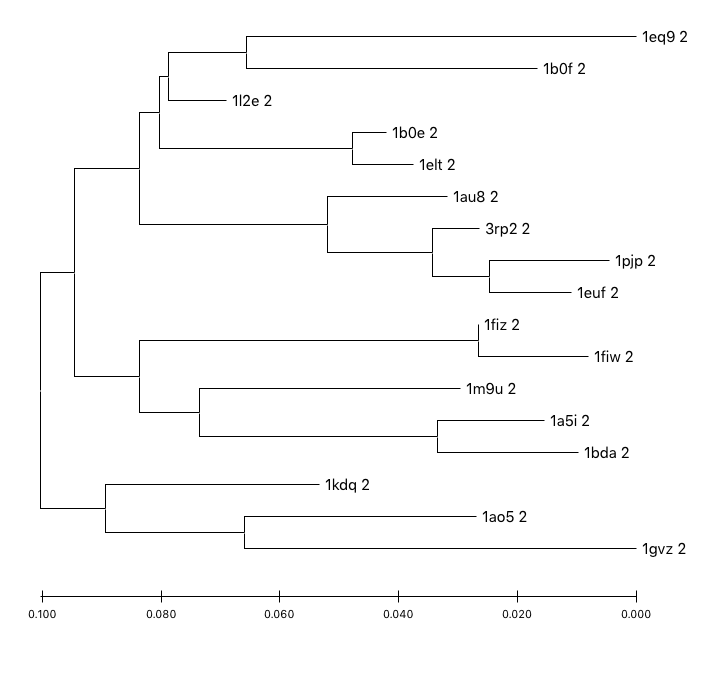
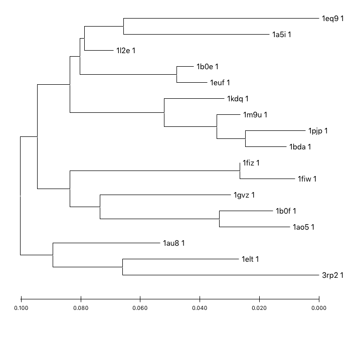
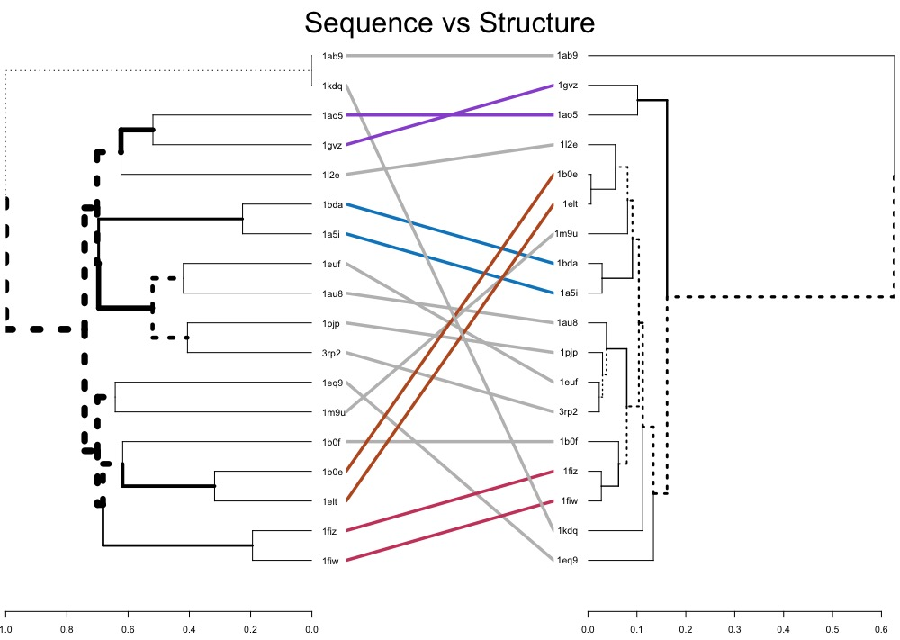

# Trypsin-Like Serine Proteases

## Sequence Trees

[clustal alignment](clustal_out.clustal_num)

[trimmed g_blocks alignment](gblocks_out_phylip)

## Structure Trees

domain 1 tree

domain 2 tree

using both domains

old tree

## Combined Tree

## structure and sequence tree comparison

tanglegram produced by R dendextend

 
