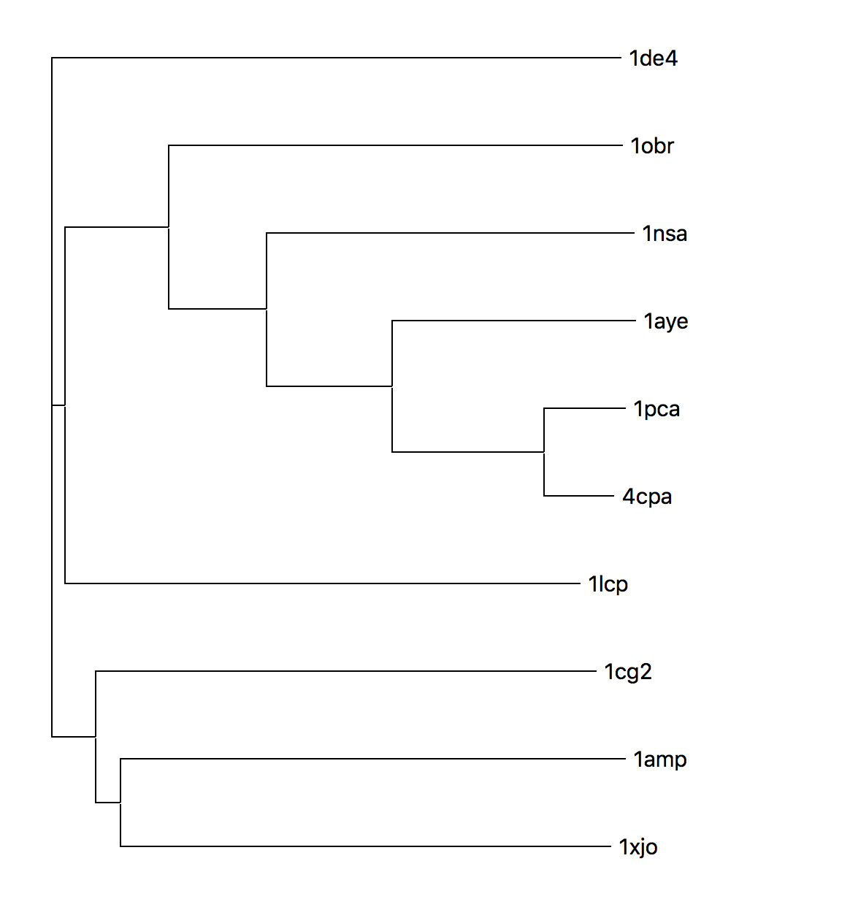
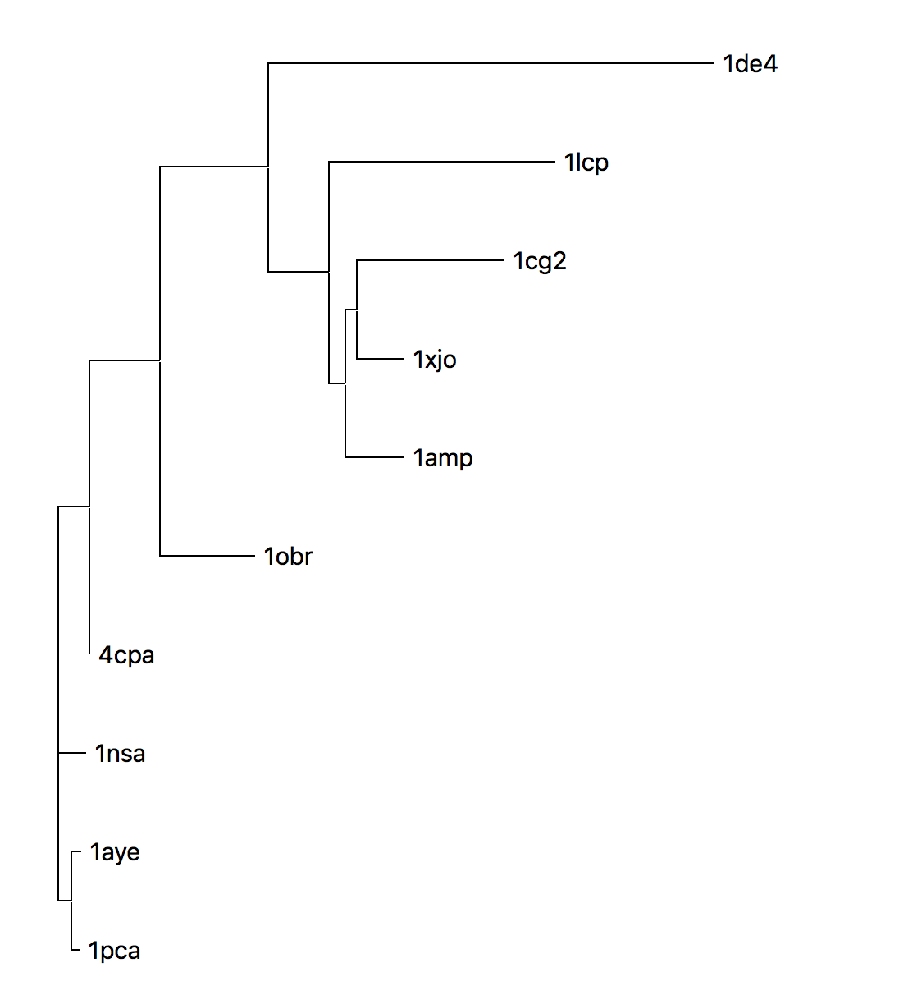
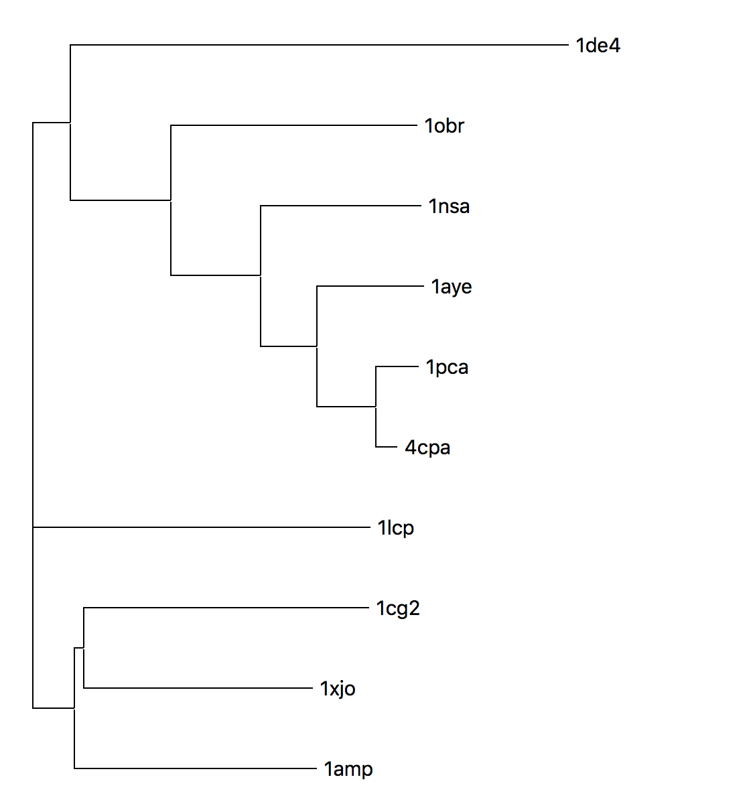

## Zinc Hydrolyse family

# Sequence Tree

[sequence alignment](sequence_alignment)

# Structure Tree

[structural alignments](struct_alignments)

RMSD
|---|1de4 | 1obr | 1nsa | 1aye | 1pca | 4cpa | 1lcp | 1cg2 | 1amp | 1xjo |
|---|---|---|---|---|---|---|---|---|---|---|
|1de4| | | | | | | | | |
|1obr|5.86| | | | | | | | |
|1nsa|6.46 |1.61 | | | | | | | |
|1aye|6.41 |1.59 |1.38 | | | | | | | 
|1pca|6.27 |1.58 |1.45 |1.18 | | | | | |
|4cpa|6.03 |1.60 |1.18 |1.17 |0.48 | | | | | 
|1lcp|6.16 |4.68 |4.56 |4.72 |4.84 |4.57 | | | |
|1cg2|6.26 |4.13 |4.13 |4.08 |3.88 |3.79 |4.26 | | | 
|1amp|6.41 |3.62 |3.96 |3.59 |3.62 |3.53 |4.30 |6.41 | |
|1xjo|6.74 |4.03 |3.76 |3.58 |3.83 |3.65 |3.87 |2.64 |1.89 |

# Combined Tree

